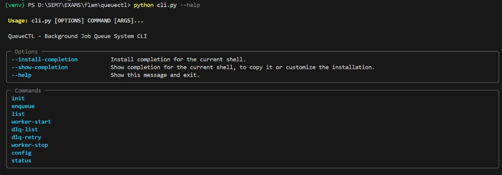
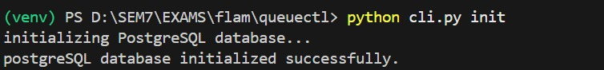
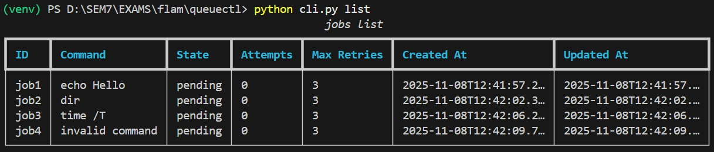
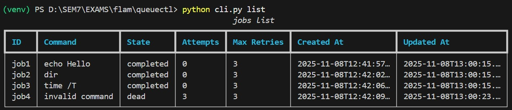
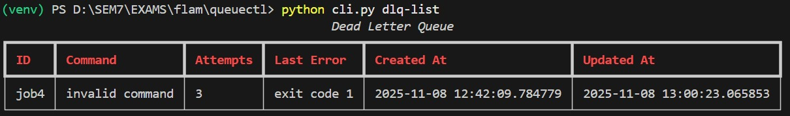
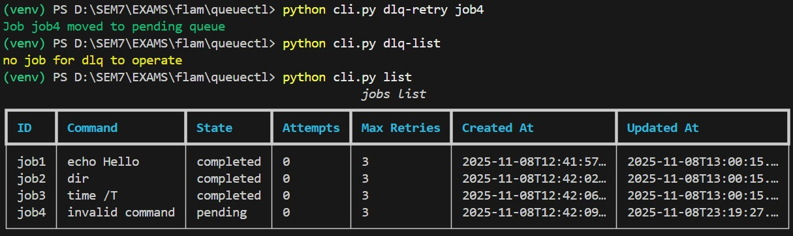
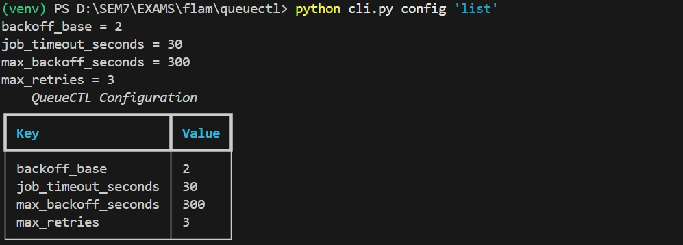
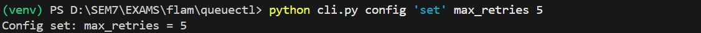
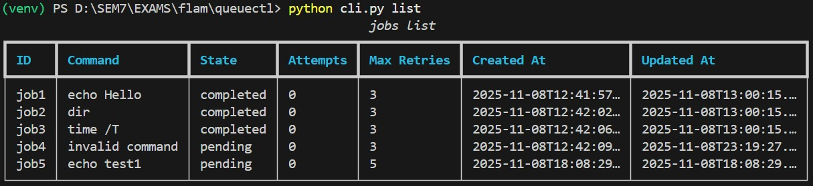
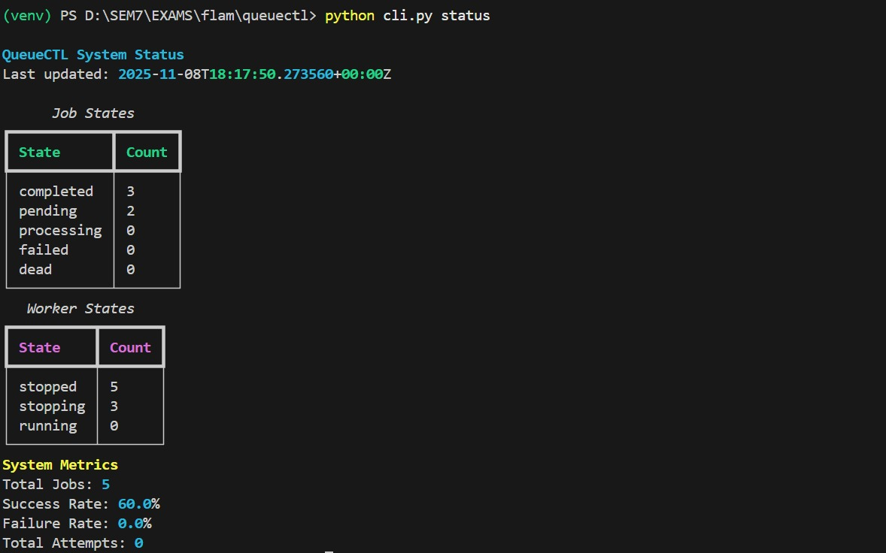

># QueueCTL - CLI based background job queue system

The tool is built in Python,designed to manage asynchronous jobs with:

1. Multiple worker process
2. Persistent PostgreSQL storage
3. Automatic retries with exponential backoff
4. DLQ to store the permanently failed jobs
5. How the jobs in DLQ were retried
6. Real-time web dashboard

This tool can :

1. enqueue job
2. initiate worker process
3. process the jobs with worker processes
4. retry the failed jobs on using dlq-retry(happens automatically on executing the command)
5. handles the dead letter queue<br/>

**I have made specifically for command prompt commands**<br/>

# How to get Started ?

# **Quick SETUP** -<br/>
# **Step 1 - Cloning the Repository {Setting up the tool!!!!}** <br/>
>    git clone https://github.com/rishideep04/queuectl.git <br/>
>    cd queuectl <br/>

# **Step 2 - Create and Activate a Virtual Environment {Preventing version conflicts or any python dependencies!!!}** <br/>
>    **Create a virtual environment** <br/>
>    python -m venv venv <br/>
> 
>    **Activating the virtual environment**<br/>
>    venv\Scripts\activate      **#{works for windows}** <br/>

# **Step 3 - Install Dependencies {I have attached a requirements.txt file in the project repo,just run the command}** <br/>
>    pip install -r requirements.txt <br/>

**Before we continue,i have to clarify the reason for using PostgreSQL, which i felt a better choice for the UseCase.** <br/>

# **Why did I use PostgreSQL ?** <br/>
>Yes, I chose PostgreSQL over the other existing db.Initially I worked with SQLITE3 but i ended up with the problem of multiple writes which lead to a deadlock situation and on solving it (used the file locking mechanism which SQLITE is famous for!!) i ended up with concurrency  bottlenecks. <br/>

# **The Problem I Faced** <br/>
>When i have multiple jobs and multiple worker processes,my worker process on completing a task,it is trying for the next job ,but if the job is already assigned to a worker node, this is leading to a deadlock(1 job 2 worker nodes trying to access).so I solved the deadlock issue by preventing the shared state of worker process and locked the database so that only one worker process at a time can execute.This led to a Sequential Execution of the jobs by the worker nodes which is completely abiding the concept of asynchronous execution. <br/>
>
# **Coming back to the clarification**
with PostgreSQL i can use the SKIP LOCKED Mechanism where, if a worker node is executing a job,the other worker processes will skip that job and take the next job.this helped me control over multiple writes. <br/>


# **Step 4 - Setting up Database** <br/>
> 1. create a database (if required) <br/>
>    CREATE DATABASE queuectl; <br/>
> 2. DB configuration - <br/>
>    DB_CONFIG = { <br/>
>    "dbname": "queuectl", <br/>
>    "user": "postgres", <br/>
>    "**password**": "**Rishi@282004**", <br/>
>    "host": "localhost", <br/>
>    "port": 5432 <br/>
>    } <br/>
> 3. Initialize the Database <br/>
>    python cli.py init #initializing the database for storing the jobs,workers and configuration features **{this step can be skipped if you want to use the existing database}** <br/>

**Now we are good to go !!!!** <br/>
**the setup is ready to use**  <br/>

# Usage Examples — CLI Commands with Example Outputs
 1. **Help for finding out the available commands** <br/>
    
 2. **We initialize the Database** <br/>
     <br/>
 3. **Start Enqueue the Jobs** <br/>
     <br/>
 4. **Job Table Contents after enqueuing of jobs** <br/>
     <br/>
 5. **Starting the Workers to execute the Tasks(Asynchronous Execution)** <br/>
     <br/>
>   **Jobs List after Execution by the worker processes** <br/>
     <br/>
 6. **Now that there is a Dead process in the Job table, it is stored in the Dead Letter Queue(DLQ)** <br/>
     <br/>
 7. **retrying the dead process from the DLQ[my worker nodes will wait for a new job upon executing a job,so when i execute the dlq-retry,worker node will take job and execute it.here in the below image i have stopped the worker nodes to show that,once this command is executed,the job is made ready to get executed by the worker node]** <br/>
     <br/>
 8. **changing the configuration of execution using [max_retries,backoff_base,max_backoff_seconds,job_time_out_seconds]** <br/>
 >  listing the configuration settings <br/>
     <br/>
 >  changing the configuration settings, i'm going to change for max_retries <br/>
     <br/>
 >  listing the configuration settings <br/>
     <br/>
 >  job table after the change in config settings and a new job **job5** is enqueued will follow the new updated configuration settings,also the dead job after dlq retry will follow the new updated configuration settings <br/>
     <br/>
 9. **Stopping the Workers,status of the worker node is shown in the below image** <br/>
     <br/>
 10. **Finding the status of the worker nodes,jobs** <br/>
     <br/>

# Architecture Overview

| Component | Description |
|------------|--------------|
| **`cli.py`** | Command Line Interface for job management like enqueue, list, retry, config, status, and worker control. |
| **`worker.py`** | Handles job execution, state transitions, retries, and failure management. |
| **`db.py`** | Handles all database interactions (PostgreSQL) like schema creation, safe inserts(optional feature), and connections. |
| **`job_store.py`** | Enqueue logic and job retrieval with configuration-based behavior. |
| **`scheduler.py`** | Implements exponential backoff and retry scheduling. |
| **`config_mgr.py`** | Manages global runtime configuration values. |
| **`status.py`** | Aggregates live system statistics and metrics for CLI reporting. |
| **`dashboard.py`** | Lightweight Flask web dashboard for real-time monitoring. |
| **`templates/dashboard.html`** | Bootstrap-based UI template for live job/worker overview. |

> **safe insert helps when there is an error occured while inserting in database or transaction,it repeats it**

### **High-Level Data Flow**
```mermaid
flowchart TD

    A[CLI (enqueue)] --> B[(PostgreSQL\njobs table)]
    B --> C[Worker (poll loop)]
    C --> D[Execute Command]
    D --> E{Job Result?}
    
    E -->|Success| F[Update State → completed]
    E -->|Failure| G[Update State → failed\nRetry with backoff]
    G --> H{Max Retries Reached?}
    H -->|No| I[Schedule Next Attempt]
    H -->|Yes| J[Mark as Dead (DLQ)]

    F --> K[CLI list / Web Dashboard]
    I --> C
    J --> K

    style A fill:#00b3ff,stroke:#0077aa,stroke-width:2px,color:white
    style B fill:#ffcc00,stroke:#aa8800,stroke-width:2px,color:black
    style C fill:#4CAF50,stroke:#2e7d32,stroke-width:2px,color:white
    style D fill:#6a1b9a,stroke:#4a148c,stroke-width:2px,color:white
    style F fill:#00c853,stroke:#00701a,stroke-width:2px,color:white
    style G fill:#ff7043,stroke:#bf360c,stroke-width:2px,color:white
    style J fill:#ffa000,stroke:#e65100,stroke-width:2px,color:white
    style K fill:#90a4ae,stroke:#455a64,stroke-width:2px,color:white


